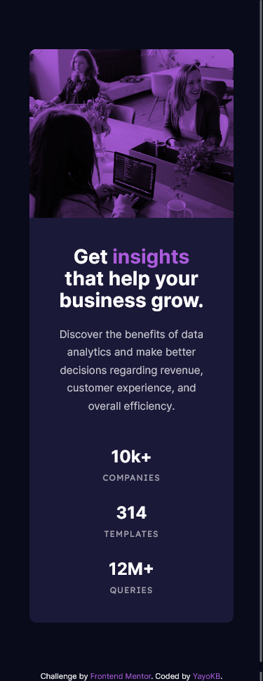

# Frontend Mentor - Stats preview card component solution

This is a solution to the [Stats preview card component challenge on Frontend Mentor](https://www.frontendmentor.io/challenges/stats-preview-card-component-8JqbgoU62). Frontend Mentor challenges help you improve your coding skills by building realistic projects.

## Table of contents

- [Overview](#overview)
  - [The challenge](#the-challenge)
  - [Screenshot](#screenshot)
  - [Links](#links)
- [My process](#my-process)
  - [Built with](#built-with)
  - [What I learned](#what-i-learned)
- [Author](#author)

## Overview

### The challenge

Users should be able to:

- View the optimal layout depending on their device's screen size

### Screenshot

### Links

- Solution URL: [GitHub](https://github.com/yayokb/fem-stats-preview-card)
- Live Site URL: [GitHub Pages](https://yayokb.github.io/fem-stats-preview-card)

## My process

### Built with

- Semantic HTML5 markup
- CSS custom properties
- CSS Grid
- Mobile-first workflow

### What I learned

I learned about the `background-blend-mode` property in order to obtain the purple overlay on the image.

## Author

- GitHub - [YayoKB](https://www.github.com/YayoKB)
- Frontend Mentor - [@YayoKB](https://www.frontendmentor.io/profile/YayoKB)
